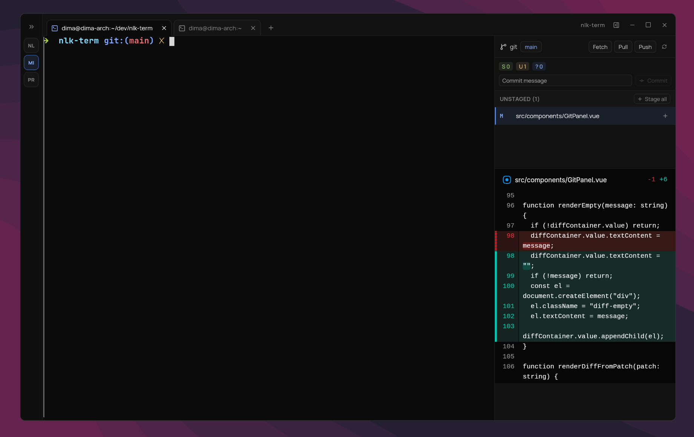

# nlk-term

Minimal terminal built with agents orchestration in mind.



## Features

- Projects-first layout with a dedicated left sidebar and tabs
- Embedded terminal sessions (`ghostty-web`)
- Persisted UI state between launches
- Git panel:
  - status and diff view
  - stage/unstage per file
  - grouped file list (`Staged` / `Unstaged`)
  - `Stage all` for the whole unstaged group
  - commit + optional `Commit with amend`
  - remote actions: `Fetch`, `Pull`, `Push`
  - ahead/behind counters near `Push` / `Pull`
  - branch switcher in modal dialog

## Stack

- Frontend: Vue 3, TypeScript, Vite
- Desktop shell: Tauri v2
- Backend commands: Rust
- UI primitives: reka-ui

## Requirements

- Bun
- Rust toolchain
- Tauri v2 prerequisites for your OS: https://tauri.app/start/prerequisites/

## Development

```bash
bun install
bun run tauri:dev
```

Alternative dev commands for Linux:

```bash
bun run tauri:dev:safe
bun run tauri:dev:x11
```

## Build

```bash
bun run build
bun run tauri build
```
